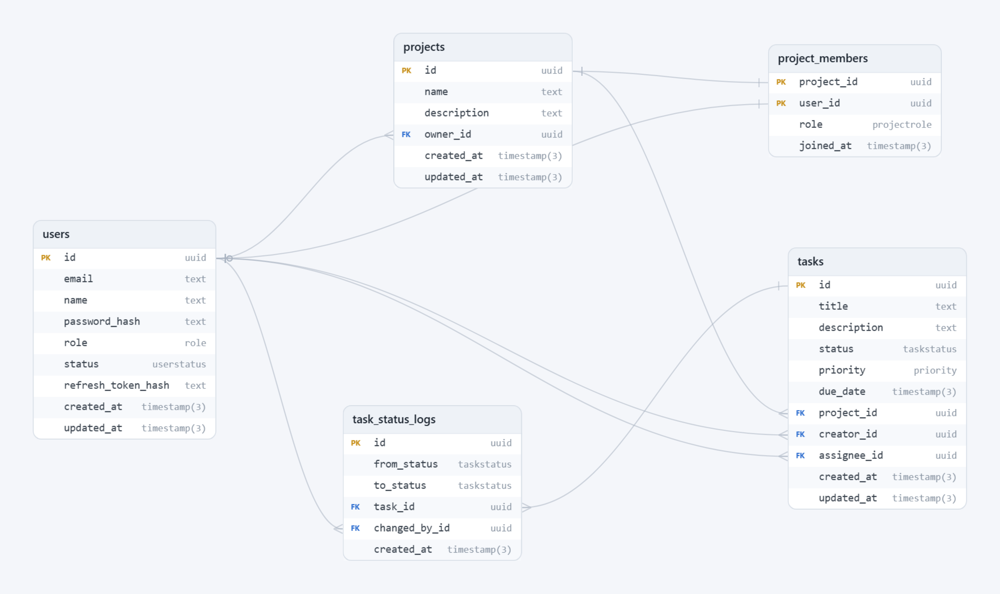

# Task Management System

Ứng dụng quản lý công việc nhóm: backend API + frontend Kanban. Người dùng đăng ký/đăng nhập, tạo project, mời member, quản lý task (kéo thả đổi trạng thái), theo dõi dashboard.

| Thành phần | Công nghệ |
| --- | --- |
| Backend | Node 22, Express 5, TypeScript strict, Prisma v6, PostgreSQL, Zod, JWT, Swagger UI |
| Frontend | Vite, React 19, TypeScript strict, Tailwind v4, axios, react-router-dom v7, dnd-kit, lucide-react |
| Hạ tầng | Docker Compose, GitHub Actions CI, vitest |

## Mục lục

- [1. Chạy nhanh bằng Docker (khuyên dùng)](#1-chạy-nhanh-bằng-docker-khuyên-dùng)
- [2. Chạy local (không Docker)](#2-chạy-local-không-docker)
- [3. Tài khoản](#3-tài-khoản)
- [4. Chức năng đã hoàn thành](#4-chức-năng-đã-hoàn-thành)
- [5. Sơ đồ database](#5-sơ-đồ-database)
- [6. Chưa làm và hướng phát triển](#6-chưa-làm-và-hướng-phát-triển)

## 1. Chạy nhanh bằng Docker (khuyên dùng)

```bash
docker compose up --build
```

- Frontend: http://localhost:5173 (đăng ký / đăng nhập tại đây)
- Backend: http://localhost:3000/api — Swagger: http://localhost:3000/api-docs
- Lần đầu backend tự chạy migration + seed dữ liệu mẫu.
- Dọn sạch DB của stack: `docker compose down -v`

> Docker **không đọc** `backend/.env` (đã loại khỏi image). Đổi secret/pass seed cho Docker bằng file `.env` ở **thư mục gốc**:
> ```env
> POSTGRES_PASSWORD=123456
> JWT_ACCESS_SECRET=...
> JWT_REFRESH_SECRET=...
> SEED_ADMIN_PASSWORD=Admin123!
> ```

## 2. Chạy local (không Docker)

Cần PostgreSQL ở `localhost:5433`, DB `ichi_db` (sửa trong `backend/.env` nếu khác).

```bash
# Backend
cd backend
npm install
cp .env.example .env   # rồi điền secret
npx prisma migrate dev
npm run prisma:seed
npm run dev            # http://localhost:3000

# Frontend (terminal khác)
cd frontend
npm install
npm run dev            # http://localhost:5173
```

## 3. Tài khoản

| Loại | Email | Mật khẩu |
| --- | --- | --- |
| SUPERADMIN (seed) | `admin@example.com` | theo `SEED_ADMIN_PASSWORD` |
| Member mẫu (seed) | `an@`, `binh@`, `chi@`, `dung@example.com` | `member123` (hoặc `SEED_MEMBER_PASSWORD`) |
| Tự đăng ký | trang **Đăng ký** (`/register`) | tự đặt (≥ 6 ký tự) |

Lưu ý: đổi `SEED_ADMIN_PASSWORD` rồi seed lại **không** đổi pass admin đã tồn tại (seed dùng upsert không ghi đè).

## 4. Chức năng đã hoàn thành

| # | Chức năng | Chi tiết |
| --- | --- | --- |
| 1 | Đăng ký public | Luôn `MEMBER`, chống trùng email (409), chặn nâng role, trả token luôn |
| 2 | Đăng nhập/đăng xuất | Access 1h + refresh 7d xoay vòng (lưu SHA-256); tài khoản khóa vẫn 403 dù token còn hạn |
| 3 | Đổi mật khẩu | Cần login, xác thực pass hiện tại, xoay vòng token (đăng xuất các phiên khác) |
| 4 | Quên/đặt lại mật khẩu | Token riêng hạn 15 phút, không lộ email tồn tại; dev trả token trực tiếp (chưa có mail server) |
| 5 | Quản lý user (SUPERADMIN) | Tạo MEMBER, khóa/mở khóa/xóa (chống tự khóa/tự xóa/khóa admin khác) |
| 6 | Project | SUPERADMIN tạo, owner tự động LEAD, phân quyền scope (ngoài scope 404 chung) |
| 7 | Member | Mời (userId/email), đổi LEAD/MEMBER, xóa (trừ owner), `GET /projects/mine` kèm vai trò + việc dở |
| 8 | Task CRUD | Tiêu đề/mô tả/trạng thái/ưu tiên/hạn; assignee phải là member/owner ACTIVE |
| 9 | Tìm kiếm/lọc/phân trang | Quét tiêu đề + mô tả, lọc status/priority/assignee, `take` tối đa 100 |
| 10 | Kanban | Kéo thả đổi cột (optimistic + rollback), endpoint `/status` riêng, F5 giữ cột |
| 11 | Lịch sử task | Log khai sinh + mọi lần đổi (ai, khi nào), tab Activity theo project |
| 12 | Dashboard admin | `GLOBAL`: tổng/byStatus/quá hạn/sắp hạn 7 ngày + thống kê user + mọi project |
| 13 | Dashboard member | `PROJECTS` + `PERSONAL`: việc của tôi quá hạn/sắp hạn/sắp đến hạn |
| 14 | Tài liệu API | Swagger UI tại `/api-docs` |
| 15 | Seed demo | 5 user, 3 project, 9 task + log trạng thái, chạy lại không trùng |
| 16 | Test + CI + Docker | 38 unit test backend, GitHub Actions (test/typecheck/build), Compose full stack |

## 5. Sơ đồ database



## 6. Chưa làm và hướng phát triển

- Deploy demo public (cần làm để nộp bài cùng video demo 3–5 phút).
- Test phía frontend (hiện chỉ backend có test).
- Gửi mail thật cho quên mật khẩu (hiện demo trả token trực tiếp), realtime/websocket, thông báo.
- Rate-limit endpoint auth public.
